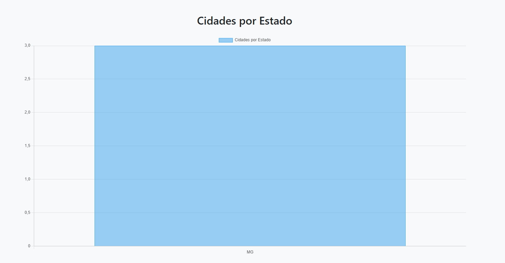
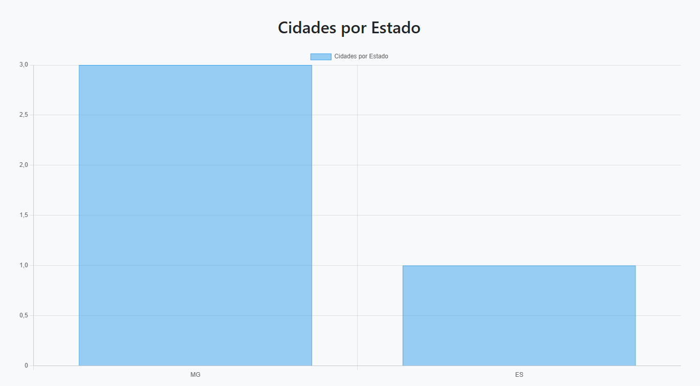

# Trabalho Prático 07 - Semanas 13 e 14

A partir dos dados cadastrados na etapa anterior, vamos trabalhar formas de apresentação que representem de forma clara e interativa as informações do seu projeto. Você poderá usar gráficos (barra, linha, pizza), mapas, calendários ou outras formas de visualização. Seu desafio é entregar uma página Web que organize, processe e exiba os dados de forma compreensível e esteticamente agradável.

Com base nos tipos de projetos escohidos, você deve propor **visualizações que estimulem a interpretação, agrupamento e exibição criativa dos dados**, trabalhando tanto a lógica quanto o design da aplicação.

Sugerimos o uso das seguintes ferramentas acessíveis: [FullCalendar](https://fullcalendar.io/), [Chart.js](https://www.chartjs.org/), [Mapbox](https://docs.mapbox.com/api/), para citar algumas.

## Informações do trabalho

- Nome: Ana Clara Castro Carneiro
- Matricula: 898743
- Proposta de projeto escolhida: Lugares e Experiências
- Breve descrição sobre seu projeto: Site que apresenta algumas das cidades históricas de Minas Gerais que já visitei.

**Print da tela com a implementação**

Foi criada uma nova página de visualização dinâmica utilizando Chart.js, que lê os dados cadastrados pelo CRUD e gera automaticamente um gráfico de barras mostrando a quantidade de cidades por estado. Para isso, adicionei o novo campo estado no formulário, atualizei o banco de dados, ajustei o app.js para salvar e exibir esse campo e implementei a função montarGrafico(), que processa os dados da API e renderiza o gráfico. A visualização agora responde em tempo real às alterações feitas no cadastro, edição ou exclusão de cidades.

